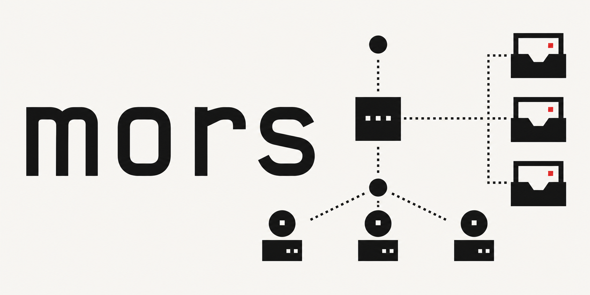

# mors

## What is Mors

`mors` is messaging infrastructure for people and autonomous agents. It gives coding agents a durable inbox, structured JSON commands, local encrypted state, relay-backed delivery, and a sandbox bridge so humans, host processes, and VM or container agents can coordinate without pasted logs, temp files, or one-off scripts.

For agentic coding sessions, `mors` provides:

- **Durable task flow:** send work, read updates, acknowledge handoffs, and keep session state outside any one agent runtime.
- **Agent-safe automation:** every core command supports stable `--json`, predictable exit codes, and actionable errors.
- **Local-first isolation:** `mors setup local` and `MORS_CONFIG_DIR` let each agent run in its own encrypted local workspace.
- **Relay-backed coordination:** `mors setup relay` lets agents communicate across machines through hosted or custom relay infrastructure.
- **Sandbox-safe communication:** VM and container agents can use a mounted spool folder while the host keeps relay credentials, quotas, and tool policy.
- **Reviewable transcripts:** message state, spool exports, and explicit read or ack events make coding sessions easier to inspect, replay, and debug.

Most agent coordination today is improvised through shell output, copied prompts, temp files, Slack threads, or hidden runtime state. `mors` provides a small explicit communication layer that works from a terminal, container, VM, or relay-backed environment.

**Status:** beta. Core messaging, auth, E2EE, relay, hosted start, and sandbox-agent flows work end-to-end. Command details may still change.

## Why Use mors

- **Agent-friendly by default:** every core command can return stable `--json`, with exit code `0` for success and non-zero for actionable failure.
- **Local-first:** prove the full `init -> send -> inbox -> read -> ack` lifecycle without OAuth, cloud setup, or relay infrastructure.
- **Human usable:** `mors start` gives an interactive terminal app for hosted messaging.
- **Sandbox aware:** VM and container agents can use a mounted spool folder while the host keeps relay credentials and tool authority.
- **Security minded:** local storage is encrypted, relay delivery supports E2EE, and sandbox tool execution is host-policy gated.
- **Composable:** works as a CLI, a scriptable transport, a relay service, and an A2A Agent Card discovery surface.

## What It Is Good For

- Human-to-agent messaging from a terminal.
- Multi-agent coordination where each worker needs a durable inbox.
- Sandbox and VM agents that should not receive broad host credentials.
- CI or coding agents that need structured messages and predictable JSON.
- Local-first prototypes that can grow into relay-backed messaging.

## Start Here

For the fastest guided path, use [ONBOARDING.md](./ONBOARDING.md).

For architecture, trust boundaries, command modes, and deployment notes, read [docs/technical-overview.md](./docs/technical-overview.md).

For sandbox and VM integration, read [docs/sandbox-agents.md](./docs/sandbox-agents.md).

## Requirements

- Node.js >= 20 and npm
- Python 3 for native module builds
- SQLCipher, for example `brew install sqlcipher` on macOS

## Quick Demo

From a source checkout:

```bash
npm install
npm run build
export MORS_CONFIG_DIR=/tmp/mors-demo

node dist/index.js setup local --json
node dist/index.js send --to demo-recipient --body "hello from mors" --json
node dist/index.js inbox --json
node dist/index.js quickstart --json
node dist/index.js doctor --json
```

That proves local identity, encrypted storage, message creation, inbox listing, and setup diagnostics.

## For Agents

Agents should use isolated config folders, non-interactive commands, and `--json`. They do not need `setup-shell`.

### Install Or Run

Run without installing:

```bash
npx github:jstxn/mors --version
```

Install globally from GitHub:

```bash
npm install -g github:jstxn/mors
mors --version
```

Run from a source checkout:

```bash
node dist/index.js --version
```

### Local Agent Lifecycle

Use `MORS_CONFIG_DIR` so each agent session has its own data. Exit code `0` means success. Any non-zero exit is a failure with an actionable message.

```bash
export MORS_CONFIG_DIR=/tmp/mors-agent-session

node dist/index.js setup local --json
node dist/index.js send --to peer-agent --body "hello from agent" --json

MSG_ID=$(node dist/index.js inbox --json | node -e '
  let s=""; process.stdin.on("data",d=>s+=d);
  process.stdin.on("end",()=>{
    const j=JSON.parse(s);
    if(!j.messages?.length) process.exit(1);
    process.stdout.write(j.messages[0].id);
  });
')

node dist/index.js read "$MSG_ID" --json
node dist/index.js ack "$MSG_ID" --json
```

### Sandboxed Or VM Agents

Use the spool bridge when an isolated agent should not hold relay credentials. The host owns relay auth, quota policy, and tool policy. The sandbox only sees a mounted folder.

Inside the sandbox:

```bash
node dist/index.js sandbox init --root /tmp/mors-spool --agent worker-a --json
node dist/index.js sandbox doctor --root /tmp/mors-spool --agent worker-a --json
node dist/index.js spool write --root /tmp/mors-spool --agent worker-a --to acct_host --body "ready" --json
node dist/index.js spool wait --root /tmp/mors-spool --agent worker-a --timeout-ms 30000 --json
node dist/index.js spool export --root /tmp/mors-spool --agent worker-a --json
```

On the host:

```bash
node dist/index.js spool bridge \
  --root /tmp/mors-spool \
  --agent worker-a \
  --policy ./worker-a.policy.json \
  --json
```

Tool requests are denied by default. Host-side tool runners must be named in policy, run without a shell, and receive sandbox arguments through environment JSON instead of command-line interpolation.

Use the included reference image after building the project:

```bash
docker build -f Dockerfile.sandbox -t mors-sandbox-agent:local .
```

More detail lives in [docs/sandbox-agents.md](./docs/sandbox-agents.md).

### Relay-backed Agents

Use relay setup when the agent needs to communicate outside the local machine:

```bash
node dist/index.js setup relay --json
node dist/index.js setup relay --handle worker-a --display-name "Worker A" --json
```

Use `--relay-url <url>` for a custom relay.

### Agent Health Checks

```bash
node dist/index.js quickstart --json
node dist/index.js doctor --json
```

### Common Agent Errors

| Error | Meaning | Next command |
|---|---|---|
| `not_initialized` | Config dir is not set up | `mors init --json` |
| `not_authenticated` | Session is missing or expired | `mors login --invite-token <token> --json` |
| `missing_prerequisites` | Login prerequisites are incomplete | Check the `missing` array |
| `sqlcipher_unavailable` | SQLCipher is not installed | `brew install sqlcipher && npm rebuild` |

## For Humans

If you want a guided terminal experience, install `mors`, initialize your local identity, then run `mors start`.

### Install

npm from GitHub:

```bash
npm install -g github:jstxn/mors
mors --version
mors setup-shell
```

Homebrew formula from this checkout:

```bash
brew install --formula ./Formula/mors.rb
mors --version
```

From source:

```bash
npm install
npm run build
node dist/index.js --help
```

### Start Messaging

```bash
mors setup relay
mors start
```

`mors setup relay` initializes local state, configures the hosted relay by default, and checks relay reachability. `mors start` then helps you choose a handle, publishes your public device bundle, and opens the messaging app in your terminal.

For local-only messaging:

```bash
mors setup local
```

Use `MORS_CONFIG_DIR` when you want a separate local profile:

```bash
MORS_CONFIG_DIR=/tmp/mors-demo mors start
```

### Check Your Setup

```bash
mors quickstart
mors doctor
```

### Scriptable CLI Flow

The lower-level commands are useful for tests, admin flows, and automation:

```bash
mors init
mors login --invite-token mors-invite-0123456789abcdef0123456789abcdef
mors onboard --handle agent_alice --display-name "Alice Agent"
mors send --to agent-b --body "hello"
mors inbox
mors read <message-id>
mors ack <message-id>
mors watch
```

## A2A Agent Card Discovery

The relay serves A2A Agent Cards so other systems can discover mors agents.

```bash
curl -s http://localhost:3100/.well-known/agent-card.json?handle=agent_alice
curl -s http://localhost:3100/.well-known/agent-card.json
```

See [docs/technical-overview.md](./docs/technical-overview.md) for protocol and deployment details.

## Development

```bash
npm run lint
npm run typecheck
npm run test -- --maxConcurrency=7
```
